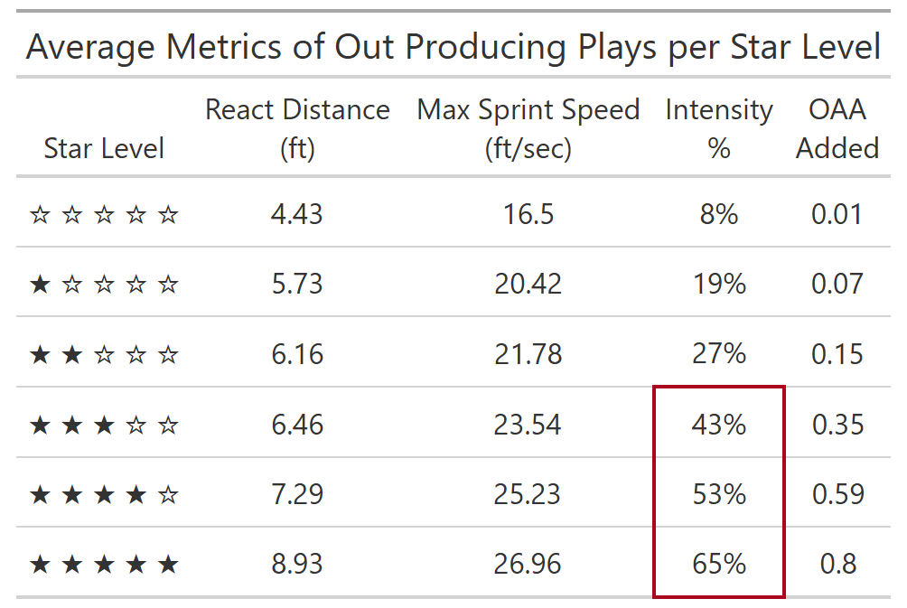
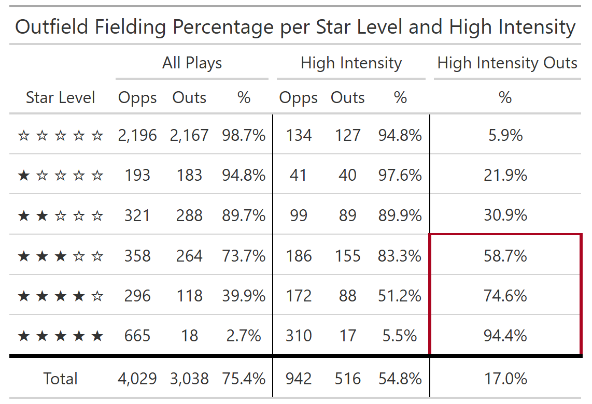
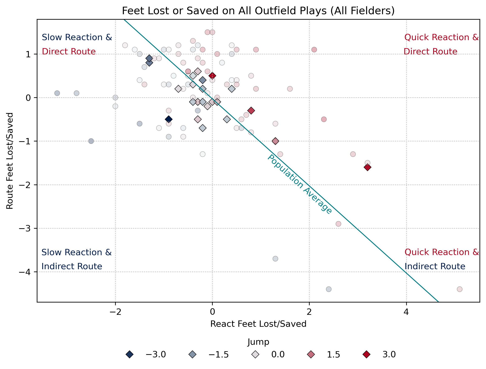
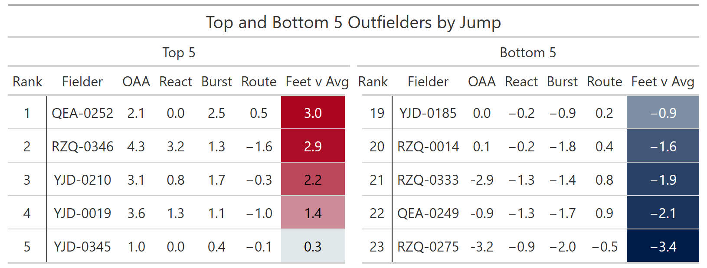
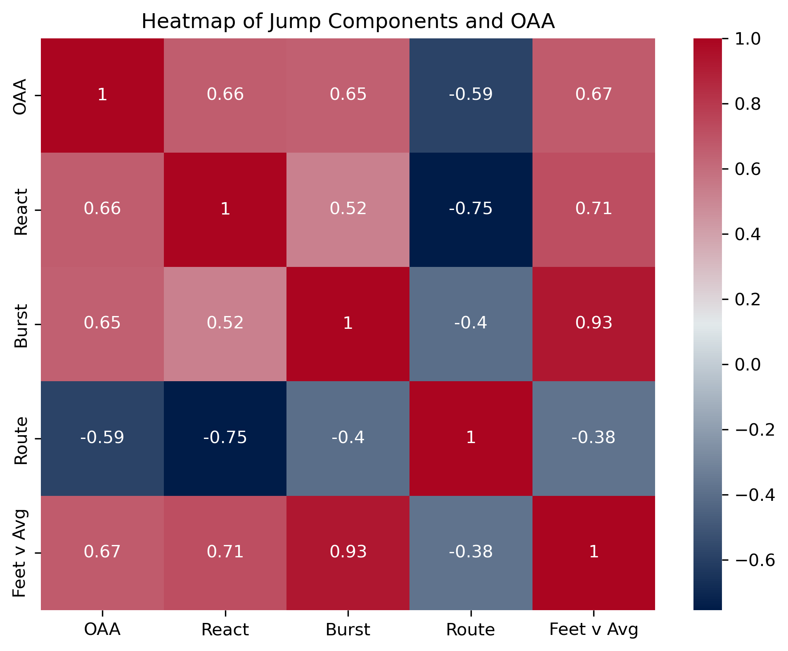

# Go Ahead and Jump: Early and Often
 
## Introduction

This project is my submission to the 2025 [SMT](https://smt.com/) Data Challenge where I used Python and SQL with Minor League player and ball tracking data to analyze metrics of outfielder’s routes, calculate Outs Above Average (OAA), recreate Statcast's [Jump](https://baseballsavant.mlb.com/leaderboard/outfield_jump) metric, and introduce Route Intensity which is the percentage of the outfielder’s route that an outfielder exerts high intensity by traveling at or near their max sprint speed.

The project is divided into 3 notebooks and a detailed write up on the insights this project provides.

[Data Engineering notebook](Data_Engineering.ipynb) demonstrates the process of extracting, cleaning, validating, and transforming the data used in this project.

[Modeling notebook](Modeling.ipynb) goes through the preprocessing of data and cross-validation of the logistic regression model.

[Analysis notebook](Analysis.ipynb) provides the insights into outfield metrics such as OAA, Jump, and Route Intensity that contribute to an outfielder's ability to catch low probability plays.

The full write up and submission can be read [here](go_ahead_and_jump_writeup.pdf).
## Findings and Visualizations
### Outfielder Opportunity Space

All of the 2-3 Star plays require less than the population’s median sprint speed and the majority of the 5 Star plays require greater than the population’s median sprint speed. The 5 Star plays that require less than the median sprint speed occur within the first 3 seconds of the route. To convert those balls into outs, the fielders would need to be moving at a constant speed of 19.8 ft/sec for the entirety of the route.

### Route Intensity

Routes that have high route intensity (>40% intensity) provide more value as they improve the likelihood of success on higher difficulty plays.

### Fielding Percentages

Outs recorded on routes with high intensity make up 65% of all 3+ Star difficulty recorded outs.

### Jump Metrics

Fielders with quick reactions and direct routes are up and to the right of the population average line, whereas fielders that have slow reactions and indirect routes are located on the bottom left of the population line. Fielders with a high Jump metric have a red point and fielders with a low Jump metric have a blue point. Diamonds indicate fielders with at least 15 2+ Star Level opportunities.

The Top 5 outfielders all have positive values during their React and Burst phases, meaning that they travel more distance during these phases than the average outfielder. The Bottom 5 outfielders all have negative values during these same two phases, and have fairly efficient Route.

 

Route has a strong negative correlation to OAA, meaning that the closer the outfielder’s total distance traveled is to the direct distance needed, the worse their OAA will be. Additionally, React has a negative correlation with Route. This makes intuitive sense that the distance the outfielder is traveling at the beginning of the route is when they have the least amount of information about 12 where the ball will end up, leading to indirect routes. 

## Conclusion
Converting balls into outs is about more than running fast. Outfielders need to start moving as soon as they possibly can. By analyzing the three phases of a fielder’s Jump in conjunction with their OOA, more specific feedback can be given to that fielder to convert balls into outs. Outs recorded with high route intensity account for 65% of all outs on the most difficult plays, and what is route intensity if not a measurement of the fielder covering more distance for longer periods of time. What is important is that the fielder covers distance, regardless of the direction. This is seen with Route’s strong negative correlation to OAA and positive correlation with Jump components that measure the amount of distance in any direction. So instead of just telling players to catch more balls, we can tell them to move early and often. 
